# Musia NLP Module — Architecture

## Vue d'ensemble

Le module NLP est une **API FastAPI Python** qui alimente le robot guide de musée Musia. Il orchestre quatre services AI et expose une API REST + Socket.IO.

```
┌─────────────────────────────────────────┐
│           Clients                        │
│  Robot (Socket.IO) │ Web (REST/Swagger)  │
└──────────────┬──────────────────────────┘
               │
               ▼
┌─────────────────────────────────────────┐
│         FastAPI + Socket.IO             │
│    /docs (Swagger UI) /redoc (ReDoc)    │
│                                         │
│  ┌──────────┐  ┌──────────┐            │
│  │ REST API │  │ Socket.IO│            │
│  └──────┬───┘  └────┬─────┘            │
└─────────│────────────│─────────────────-┘
          │            │
          ▼            ▼
┌─────────────────────────────────────────┐
│              Services AI                │
│                                         │
│  STT (Whisper) │ TTS (Edge TTS)        │
│  NLP (Embeddings) │ LLM (Groq/Llama3)  │
│  KnowledgeBase │ SessionManager         │
└──────────────┬──────────────────────────┘
               │
    ┌──────────┼──────────┐
    ▼          ▼          ▼
 Redis      SQLite    Musia Backend
 (sessions) (logs)    (artworks API)
```

---

## Flux de données — Question audio


---

## Flux Socket.IO — Robot waypoint

```mermaid
sequenceDiagram
    participant R as Robot
    participant SIO as Socket.IO Server
    participant SM as Session Manager
    participant TTS as TTS Service

    R->>SIO: waypoint_reached { artwork_id, artwork_name, artist, waypoint_index }
    SIO->>SM: get/create session(sid)
    SM-->>SIO: session data
    SIO->>TTS: synthesize(presentation_text)
    TTS-->>SIO: audio_path
    SIO-->>R: robot_speech { text, audio_base64, waypoint_index, session_id }
```



---

## Services

| Service | Fichier | Technologie | Rôle |
|---|---|---|---|
| **STT** | `services/stt.py` | OpenAI Whisper `small` | Audio → Texte |
| **TTS** | `services/tts.py` | Edge TTS (cloud) | Texte → Audio MP3 |
| **NLP** | `services/nlp.py` | Sentence Transformers + NLTK | Intent + RAG |
| **LLM** | `services/llm.py` | Groq / Llama 3.1-8b-instant | Génération réponse |
| **KnowledgeBase** | `services/knowledge.py` | JSON local + Musia Backend API | Données œuvres |
| **SessionManager** | `session_manager.py` | Redis + fallback mémoire | Sessions persistantes |
| **RateLimiter** | `rate_limiter.py` | Redis sliding window | 10 req/min par IP |

---

## Structure des fichiers

```
nlp-module/
├── backend-app/
│   ├── app/
│   │   ├── main.py              # FastAPI app + routes + Swagger
│   │   ├── config.py            # Pydantic Settings
│   │   ├── models.py            # Modèles Pydantic (requêtes/réponses)
│   │   ├── models_sql.py        # Modèles SQLAlchemy (logs DB)
│   │   ├── database.py          # Connexion SQLite/Neon
│   │   ├── session_manager.py   # Gestion sessions Redis
│   │   ├── rate_limiter.py      # Rate limiting Redis
│   │   ├── validators.py        # Validation requêtes
│   │   └── services/
│   │       ├── stt.py           # Speech-to-Text (Whisper)
│   │       ├── tts.py           # Text-to-Speech (Edge TTS)
│   │       ├── nlp.py           # NLP + RAG
│   │       ├── llm.py           # LLM (Groq)
│   │       └── knowledge.py     # Base de connaissance
│   └── test/
│       ├── conftest.py
│       ├── test_api_endpoints.py
│       ├── test_session_manager.py
│       ├── test_rate_limiter.py
│       └── test_validators.py
├── data/
│   ├── artworks.json            # Données œuvres (fallback)
│   ├── uploads/                 # Fichiers audio temporaires
│   └── tts_cache/               # Cache audio TTS
├── docs/                        # Documentation
├── .github/workflows/           # CI/CD GitHub Actions
├── Dockerfile                   # Image Docker multi-stage
├── docker-compose.yml           # Stack complète (app + Redis)
└── .env.example                 # Variables d'environnement
```

---

## Configuration

Toutes les variables sont définies dans `.env` (voir `.env.example`) et chargées via `pydantic-settings`.

| Variable | Requis | Défaut | Description |
|---|---|---|---|
| `GROQ_API_KEY` | ✅ | — | Clé API Groq (LLM) |
| `MUSIA_BACKEND_URL` | — | `http://localhost:3000/api` | URL du backend Musia |
| `REDIS_URL` | — | `redis://localhost:6379` | URL Redis (sessions) |
| `DATABASE_URL` | — | SQLite local | URL base de données |
| `API_HOST` | — | `0.0.0.0` | Hôte d'écoute |
| `API_PORT` | — | `8000` | Port d'écoute |
| `WHISPER_MODEL` | — | `small` | Modèle Whisper |
| `TTS_VOICE` | — | `fr-FR-DeniseNeural` | Voix TTS |
| `DEBUG` | — | `true` | Mode debug |

---

## Dépendances externes


---

## Swagger UI

FastAPI génère automatiquement la documentation interactive :

- **Swagger UI :** [`http://localhost:8000/docs`](http://localhost:8000/docs)
- **ReDoc :** [`http://localhost:8000/redoc`](http://localhost:8000/redoc)
- **OpenAPI JSON :** [`http://localhost:8000/openapi.json`](http://localhost:8000/openapi.json)

Fonctionnalités activées :
- `tryItOutEnabled` — test des endpoints directement depuis l'interface
- `displayRequestDuration` — affichage du temps de réponse
- `filter` — barre de recherche des endpoints
- Thème syntaxe `monokai`
